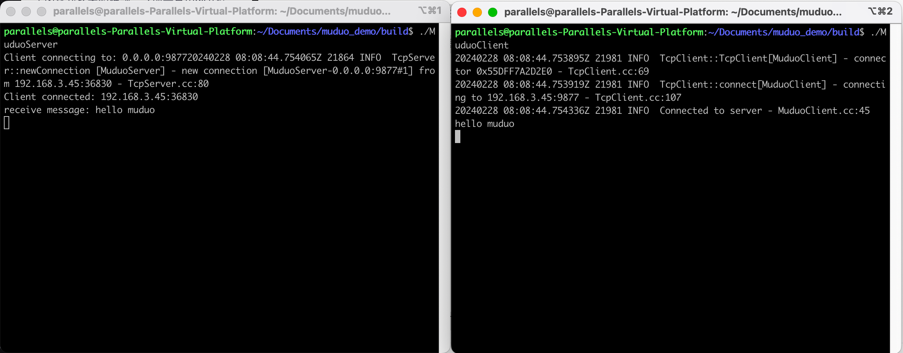

# muduo 客户端/服务器
简单的muduo c/s架构demo

# 安装muduo库
安装依赖：apt-get install libboost-all-dev
1. git clone https://github.com/chenshuo/muduo
2. cd muduo
3. ./build.sh install
4. 你会在上一级目录中看到build的目录
    ```
    /build/release-install-cpp11下面的include和lib系统/usr/include/和/usr/lib/下面即可

    在/build/release-install-cpp11目录下分别执行下面命令

    cd include/

    mv muduo/ /usr/include/

    cd ..

    cd lib/

    mv * /usr/local/lib/

    到目前为止已经安装完毕

    进行验证是否成功

    find /usr/include/muduo 

    如果找到，说明成功了，自己也可以用代码验证
    ```


# 演示图稿


